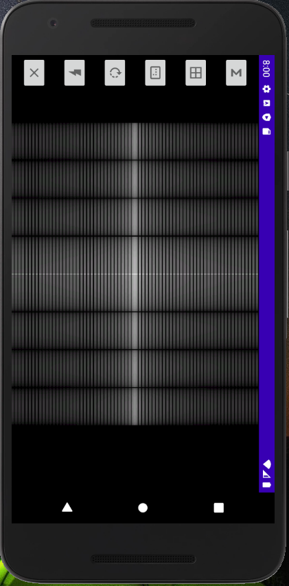
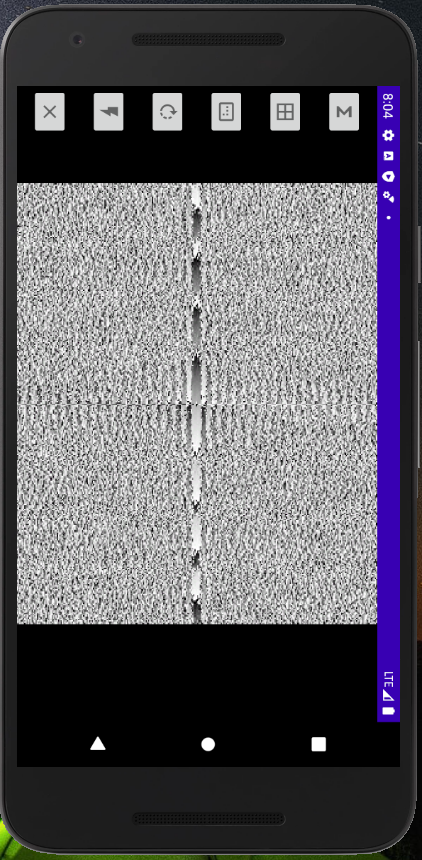

# FrequencyCam
Live preview of image frequency domain (FFT)

Following app uses captured frames to analyze their spatial domain (frequency domain or fourier domain). Those are live previewed.
You can choose either standard view, frequency or phase. Couple of extra features like rotation, matrix, quality etc.

Only in landscape mode due to opencv.

Some images of the app:

  

    

 
  AVAILABLE ON PLAY STORE
 
https://play.google.com/store/apps/details?id=com.diplabs.frequencycam3

LANGUAGES:
* JAVA + ANDROID
   
CREDITS:
* IMAGE PROCESSING: OPENCV-ANDROID 4  https://opencv.org/android/
