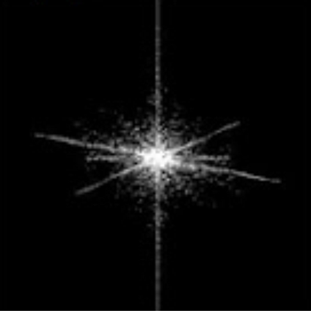
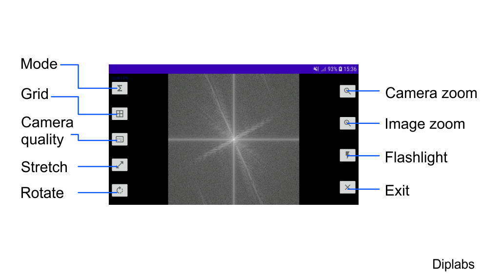

# FrequencyCam
Live preview of image frequency domain (FFT)

Following app uses captured frames to analyze their spatial domain (frequency domain or fourier domain). Those are live previewed.
You can choose either standard view, frequency or phase. Couple of extra features like rotation, matrix, quality etc.

Only in landscape mode due to opencv.

## App:

Mode: Normal view / Frequency / Phase 
Grid: 1x1 or 4x4 
Camera quality - Lowers the image quality before FFT 
Stretch - Stretch the image to full screen or square (native FFT) 
Rotate - rotate each cell towards middle (native FFT) or outside  
Camera zoom - zoom of camera before FFT 
Image zoom - zoom of converted image, after FFT 
Flashlight - as the name suggests 
Exit - as the name suggests 

 
## AVAILABLE ON PLAY STORE
 
https://play.google.com/store/apps/details?id=com.diplabs.frequencycam3

## LANGUAGES:
* JAVA + ANDROID
   
## CREDITS:
* IMAGE PROCESSING: OPENCV-ANDROID 4  https://opencv.org/android/
